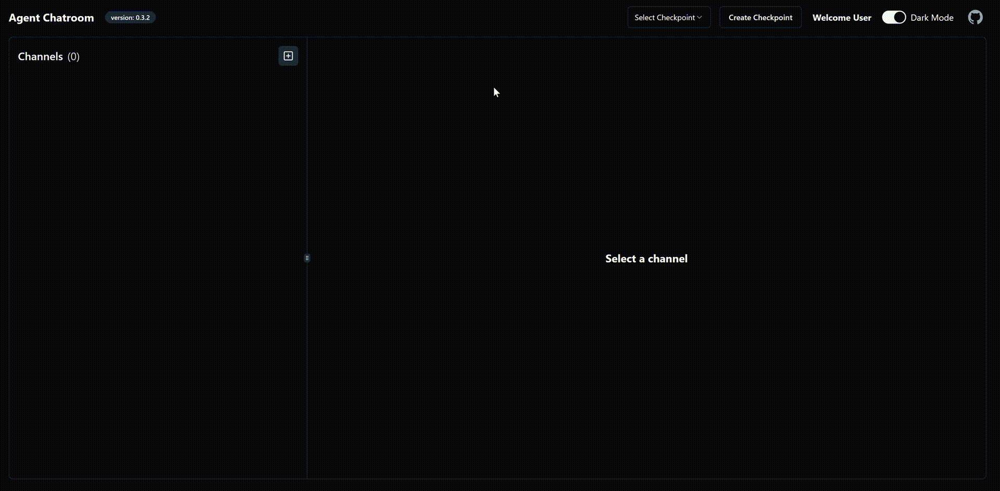

# The [ChatRoom](https://github.com/LittleLittleCloud/Agent-ChatRoom) for openai agent

This repo contains the quick-start configuration for openai agent.

## Quick Start

1. Clone this repo and navigate to the root directory of the repo.

2. Run the following command to restore dotnet tools

> [!Note]
> You need to have the [.NET 8.0 SDK](https://dotnet.microsoft.com/download/dotnet/8.0) installed to run the following command.

```bash
dotnet tool restore
```

3. Replace the `openai-api-key` in both [client.json](client.json) and [openai.json](openai.json) with your own OpenAI API key.

4. Start the Agent Chatroom!

```bash
dotnet chatroom -c client.json
```



## Further Reading
- [Agent ChatRoom](https://github.com/LittleLittleCloud/Agent-ChatRoom)
- [AutoGen.Net](https://microsoft.github.io/autogen-for-net/)
